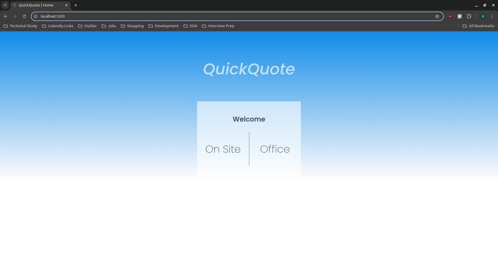
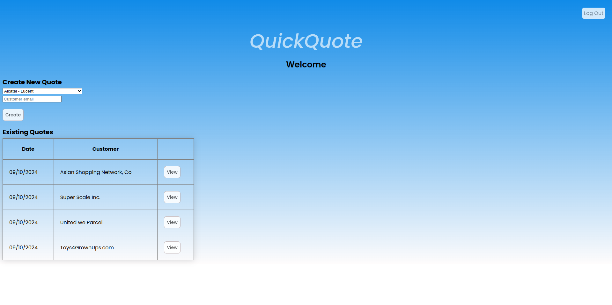
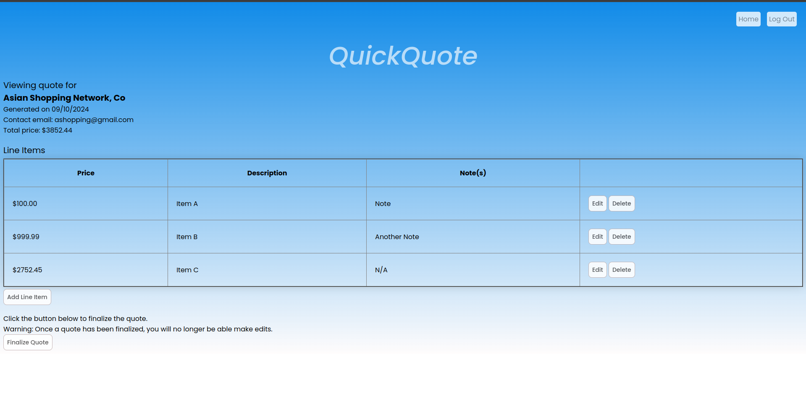
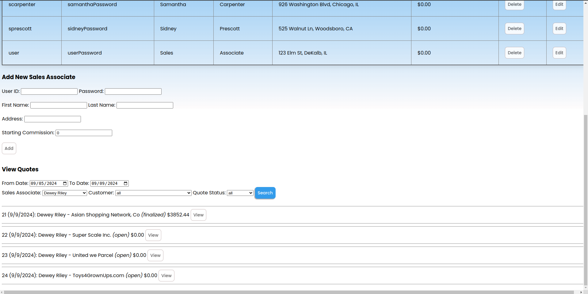

# QuickQuote

Welcome to QuickQuote! This project was developed as part of a group assignment for our Introduction to Software Engineering course. We were given a problem statement and tasked with designing and developing a solution.

## Table Of Contents
- [General Information](#general-information)
- [Technologies and Tools](#technologies-and-tools)
- [Features](#features)
- [Launching the Application](#launching-the-application)
- [Project Problem Statement](#problem-statement)

## General Information

QuickQuote is a dynamic full-stack CRUD web application designed to enhance efficiency for a plant repair service company. Our team developed this solution to simplify the sales quote process. QuickQuote offers tailored interfaces for sales associates, office workers, and administrators, providing each user with the tools they need for their specific tasks. The application simplifies key processes such as creating and editing quotes, managing purchase orders, and assigning commissions, ultimately improving the overall sales workflow. 

## Technologies and Tools

- Node.js
- Express.js
- JavaScript
- MySQL
- jQuery
- Axios
- HTML/CSS
- AWS

## Features


*Home Login Page*

QuickQuote consists of interfaces for three separate roles within the plant repair company: sales associates, office workers, and administrators.

### Sales Associate

Upon successful login to their respective portal, a sales associate can:
- Create new quotes for customers from an existing customer legacy database
- View existing quotes the associate has generated, but not finalized yet
- Add and edit individual line items for each quote, including a description, price, and optional hidden note
- Finalize sales quotes


*On Site Home Page*


*On Site Open Quote View*

### Office Worker

Upon successful login to their respective portal, an office worker can:
- View and edit all finalized quotes
- Add a discount to a sales quote in dollar amount or percentage form, which is computed into the final price
- Sanction a finalized quote, which is then sent to the customer for review and the option to order
- View all sanctioned quotes
- Add an additional final discount to a sanctioned quote, used to compute a final order price
- Convert a sanctioned quote into a purchase order upon customer confirmation, which is then sent to an external processing system that provides an order processing date and commission rate for the sales associate

*Note: Since the completion of this project, the external API endpoint provided to us for order processing has been changed. Order processing is currently simulated by providing a randomly assigned commission rate, generating a total commission for the purchase order, which is then added to the corresponding sales associate's total commission.*


*Office Home Page*


*Sanctioned Quote View*

### Administrator

Administrators access the office worker portal via their credentials. They can access all of the same functionalities as normal office workers in addition to an administrator interface, which encompasses the following functionalities:
- Perform CRUD operations on sales associates
- Find quotes via a Search form that includes filters containing creation date ranges, the sales associate, the customer, and the quote status (Open, Finalized, Sanctioned, and Ordered)
- View information for all quotes


*Admin Portal*


*Admin Quote Search Feature*

## Launching the Application

### 1. Prerequisites

Before you start, ensure you have the following installed on your local machine:
- **Node.js**: [Download and install Node.js](https://nodejs.org/en)
- **npm**: Comes with Node.js, but you can update it via the command line if needed.
- **MySQL**: Ensure that you have [MySQL](https://www.mysql.com/products/community/) installed an running on your local machine or a server. You can utilize [MySQL Workbench](https://www.mysql.com/products/workbench/) on your local machine to easier manage the database.

#### Note on MySQL Configuration
Before running the application, please ensure that your MySQL database is configured to use the `caching_sha2_password` authentication plugin, which is the default for MySQL 8.0. If you're using an older version of MySQL or your configuration is different, you may need to adjust your MySQL settings or user credentials.

To check or update the authentication plugin for your MySQL user, you can run the following query:

```sql
ALTER USER 'your_username'@'localhost' IDENTIFIED WITH caching_sha2_password BY 'your_password';
```

### 2. Clone the Repository

Download or clone the application repository to your local machine. You can do this via Git or downloading a .zip file of the project. You can clone the repository using the following command:

   ```bash
   git clone https://github.com/bdappelhans/QuickQuote.git
   ```

### 3. Install Dependencies

Navigate to the project directory and install the required dependencies in the terminal using `npm install`.

### 4. Set Up Company Database

Locate the SQL script titled `quick_quote_db.sql` found inside the `database` directory within the project. You can execute the script inside of MySQL Workbench. Alternatively, you can execute the script from the command line with the following steps:
- Ensure your command line interface is open and navigated to the project directory.
- Run the SQL script using the MySQL command line tool: 

   ```bash
   mysql -u [username] -p < database/quick_quote_db.sql
   ```
  Replace `[username]` with your MySQL username. Enter your MySQL password when prompted.
- The script will handle creating the database and the necessary tables. You can optionally check that the database and tables have been created by logging into the MySQL server from the command line with the following command: 

   ```bash
   mysql -u [username] -p
   ```
Enter your password when prompted and then execute the `SHOW DATABASES;` command from within the MySQL server. The `quick_quote` database should be present if successful.

*Note: The company database was initially hosted on AWS when this project was first completed. The database instance has since been taken down. For ease of use, the SQL script is provided to be run on your local machine, but it can also be hosted on a cloud platform like AWS.*

### 5. Configure Environment Variables

Set up environment variables to connect to both the customer legacy database and the newly created `quick_quote` database with the following steps:

- Within the project root directory, use the following command to create a `.env` file: `touch .env`. 
- Use a text editor to add database information to the `.env` file:

```env
LEGACY_HOST=blitz.cs.niu.edu
LEGACY_PORT=3306
LEGACY_DATABASE=csci467
LEGACY_USER=student
LEGACY_PASSWORD=student

DB_HOST=localhost
DB_PORT=3306
DB_DATABASE=quick_quote
DB_USER=[username]
DB_PASSWORD=[password]
```

Replace the `DB_HOST` and `DB_PORT` variables with your MySQL server's host name and password. If hosted locally, these variables are generally `localhost` and `3306`. Replace `[username]` and `[password]` with your MySQL username and password.

- Save the `.env` file.

### 6. Run the Application

Start the server by running `npm start` from within the project root directory. Open your web browser and navigate to `http://localhost:3000`. You can alter the port number from the very bottom of the `index.js` file if desired. To stop running the application, press `CTRL` + `C` at the same time from the command line.

### 7. Setting Up And Using Instance Data

Upon application launch, the company database will be populated with a handful of sales associates, office workers, sales quotes, and an administrator. 

#### Sales Associates

You can access the `On Site` interface for sales associates using any of the following credentials:

| Username | Password |
|----------|----------|
| user | userPassword |
| driley | deweyPassword |
| gweathers | galePassword |
| rmeeks | randyPassword |
| scarpenter | samanthaPassword |
| sprescott | sidneyPassword |

#### Office Workers

You can access the `Office` interface for office workers using any of the following credentials:

| Username | Password |
|----------|----------|
| bloomis | billyPassword |
| cbecker | caseyPassword |
| jroberts | jillPassword |
| kreed | kirbyPassword |
| rbridger | romanPassword |

#### Administrator

You can access the `Office` interface with access to the `Admin Portal` by using the following credentials:

| Username | Password |
|----------|----------|
| admin | adminPassword |

#### Resetting Instance Data

By default, the application will reset the instance data for the company database with each new application launch. Any additions, deletions, or updates to users and sales quotes will be wiped form the database when the applicaiton is restarted. It's good practice to do this for at least the first launch, but if you don't want the database reset with each subsequent launch, you can alter the `index.js` file in the root directory. To do so: 

- Navigate to ~line 54 in the `index.js` file. You'll see the following line of code:

```javascript
const reset_instance_data = true;
```

- Change the `reset_instance_data` variable from `true` to `false`.
- Save the `index.js` file before restarting the application.

### Additional Notes

- **Troubleshooting**: If you encounter any issues, check the project documentation or log files for errors.
- **Updates**: Within my spare time, I might be making occasional changes to the project repository for performance enhancement, fixes, and added functionality.

## Problem Statement

**The following is the problem statement that was provided to us in order to design and implement the application:**

As a group of software engineers with a company that sells plant repair services via a network of sales people, you are tasked to build a new system that enables the sales force to record their quotes via the Internet. The system will maintain a database of sales associates, handle the recording of sales quotes, establish and fulfill purchase orders. The system will also assign sales commissions for the sales associate.

A sales associate is presented with a custom quote tracking program which can be run anywhere on an Internet platform. After the associate logs in (s)he can enter sales quotes for customers. Quotes are entered for existing customers, their information is maintained in a company legacy database with customer name, address, and contact info (details provided later). A quote consists of multiple line items. Each line item has a free form description and a price. The associate can also attach secret notes of free form text. The quote is entered into a new quote database. The associate also attaches a customer e-mail address to the quote, which is used as e-mail destination for communication as the quote is processed. The associate can edit quotes until (s)he finalizes the quote.

The second interface to the system runs in-house at company headquarters: finalized quotes can be retrieved, line items added, edited or removed, and prices can be changed. A discount can be given either as percentage or amount. All line items and the discount are computed into the final price quoted. The secret notes added by the sales associate can be reviewed, and new ones added. The quotes are updated in the quote database: either left unresolved, or sanctioned. Sanctioned quotes are considered complete and sent out via e-mail to the customer. The email contains all quote data except the secret notes.

The third interface (also in-house) allows to convert a quote into a purchase order once the customer has indicated to go ahead with the order (the go ahead is given outside of the scope of this system, e.g. via phone or snail mail). At this time an additional final discount can be entered. The final amount is computed. The purchase order is then sent to an external processing system (details provided later) which answers with a processing date and sales commission rate for the sales associate. The commission is computed and recorded for the quote and in the sales associate's accumulated commission. An email is sent to the customer with all the purchase details, including the processing date.

And lastly, there will be an administrative interface to maintain sales associate and quote information. Sales associate information contains their name, user id, password, accumulated commission, and address. The interface allows to view, add, edit and delete sales associate records. It also allows to search and view quotes based on status (finalized, sanctioned, ordered), date range, sales associate, and customer.
